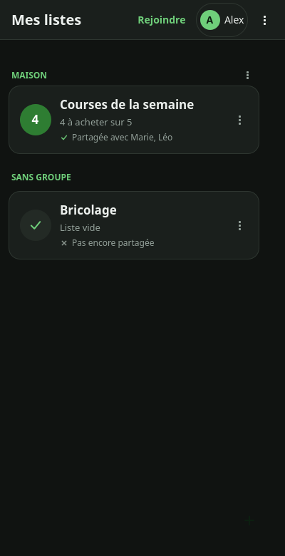
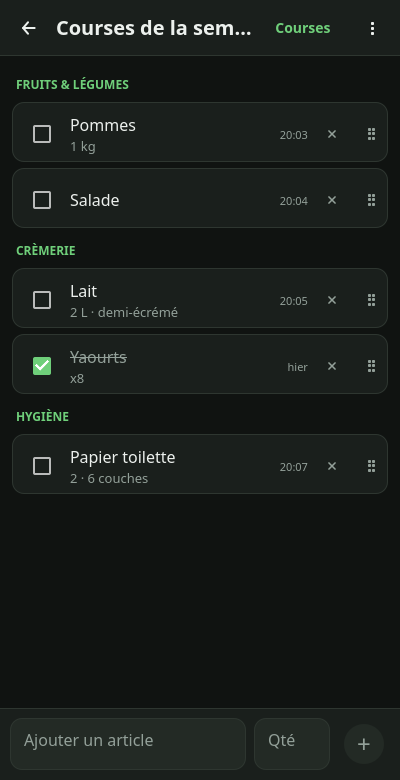
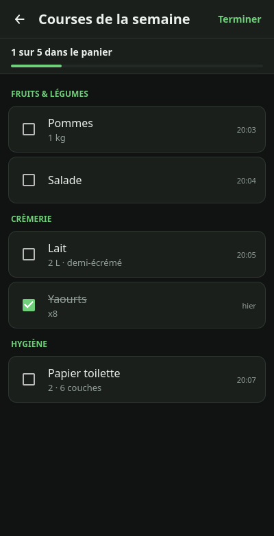

# Colo_Course

**Liste de courses partagée — privée, gratuite, sans publicité et sans serveur à soi.**

Une app simple pour faire ses courses à plusieurs : créez une liste, partagez-la par QR code, chacun l'a à jour en temps réel. Tout est chiffré de bout en bout et reste sur vos appareils — aucun compte, aucune donnée collectée, aucune publicité, aucun serveur à héberger. Fonctionne hors ligne, gère les modifications simultanées, autant de listes que de contextes. Open source, GPL v3.

[](https://github.com/Poisson48/Colo_Course/actions/workflows/ci.yml)

<p align="center">
  
  &nbsp;
  
  &nbsp;
  
</p>

<p align="center">
  <em>Listes groupées et « partagées avec »&nbsp;·&nbsp;
  Articles rangés par rayon&nbsp;·&nbsp;
  Mode Courses, une main sur le caddie</em>
</p>

## Essayer maintenant

Téléchargez la dernière version — **[⬇️ Releases](../../releases/latest)** — et lancez-la, rien à installer :

| Plateforme | Fichier | Pour l'ouvrir |
|---|---|---|
| **PC / Linux** (x86-64) | `ColoCourse-*-x86_64.AppImage` | `chmod +x ColoCourse-*.AppImage && ./ColoCourse-*.AppImage` |
| **Android** (arm64) | `colocourse-*-arm64.apk` | Ouvrez l'APK sur le téléphone (autorisez l'installation depuis cette source), ou `adb install -r colocourse-*-arm64.apk` |

L'AppImage embarque Qt : un fichier, aucune dépendance, il se lance tel quel.
L'APK est signé avec la clé de publication du projet — les versions suivantes
s'installent **par-dessus**, et l'app vous les proposera d'elle-même.

Pour tester à plusieurs : ouvrez l'app sur un premier appareil, créez une liste, partagez
le QR code (ou le lien) aux autres — les modifications s'y synchronisent en direct.

## Comment ça marche

### Architecture
- **Copie locale complète** : chaque appareil stocke tous les items et l'historique en SQLite.
- **Sync chiffrée E2E** : les données circulent via des relais Nostr publics (store-and-forward gratuit). Les relais ne voient que des blobs chiffrés ; la clé de déchiffrement reste sur l'appareil.
- **Sans conflits** : CRDT maison avec Last-Writer-Wins par champ (nom, quantité, coché) et horloges de Lamport. Les modifications simultanées convergent identiquement sur tous les appareils, sans intervention.
- **Appairage simple** : créez une liste, puis soit l'autre appareil **scanne le QR code**, soit vous lui **envoyez le lien** `colocourse://` (WhatsApp, SMS…) — un appui dessus ouvre l'app et rejoint la liste. Le lien porte la clé : ne le publiez pas.
- **Plusieurs listes, groupées** : autant de listes qu'il y a de contextes, rangées en **groupes** nommés (Maison, Boulot…). Chaque liste indique **avec qui elle est partagée**.
- **Hors ligne d'abord** : les modifications s'ajoutent immédiatement localement dans une file d'attente. Au retour du réseau, la sync reprend automatiquement, et l'app **confirme** quand tout est parti.

### Au quotidien
- **Rayons** : rangez les articles par rayon (crèmerie, surgelés…, ou vos propres rayons). La liste se regroupe en sections dans l'ordre d'un parcours de magasin. Réordonnez à la main en glissant.
- **Mode Courses** : dans le magasin, toute la ligne devient une case à cocher, une barre suit le remplissage du panier, l'écran reste allumé et cocher fait vibrer.
- **Description et quantité** par article, date d'ajout et de cochage, qui a ajouté quoi.
- **Import / export** : une liste en CSV, ou toutes vos listes en ZIP ; réimport d'un CSV ou d'un ZIP.
- **Mises à jour dans l'app** (Android) : l'app détecte les nouvelles versions, les télécharge et les installe.

### Cycle de vie
1. Créer ou rejoindre une liste via QR code / URI.
2. Ajouter / cocher / supprimer des articles localement (instantané).
3. Chiffrer et envoyer vers les relais Nostr.
4. Réception et merge automatiques chez les autres : convergence garantie.
5. Notifications locales à la réception de changements (quand l'app est ouverte).

## Build & installation

### Prérequis
- **Ubuntu/Debian** : `bash scripts/setup-dev.sh` installe les dépendances (Qt 6, libsodium, libsecp256k1, CMake, Ninja).
- **Autres OS** : adapter manuellement selon les paquets disponibles. Voir `scripts/setup-dev.sh` pour la liste complète.

### Build desktop
```bash
cmake -S . -B build -G Ninja
cmake --build build
ctest --test-dir build
```

Binaire exécutable : `build/src/colocourse`

### Android (arm64), build local

~7 Go de téléchargements (SDK, NDK, Qt pour Android) :
```bash
bash scripts/setup-android.sh   # une fois
bash scripts/build-android.sh   # → colocourse-arm64.apk, signé
```

### Publier une version

```bash
git tag -a v1.0.0 -m "…" && git push origin v1.0.0
```
Le workflow *Release* construit l'APK Android **et** l'AppImage Linux, puis les publie
dans les Releases GitHub. Le message du tag devient les notes de version (affichées
dans l'app avant une mise à jour).

## État du projet

- **Desktop Linux (bêta)** : app fonctionnelle, AppImage publié à chaque release, tests CRDT complets, sync relais opérationnelle, chiffrement E2E, appairage par QR.
- **Android (bêta)** : APK arm64 signé publié à chaque release, notifications système, mode Courses, import/export, mise à jour intégrée.

Plan détaillé et workflow : [docs/PLAN.md](docs/PLAN.md)  
Spécification technique (CRDT, protocole relais, format données) : [docs/SPEC.md](docs/SPEC.md)

## Limitations connues

- **Notifications hors app** : l'app doit être ouverte (ou en premier plan sur mobile) pour recevoir les changements en temps réel. Pas de push notification Firebase ou FCM par choix architectural (pas de serveur tiers, de compte requis). Piste v2 : foreground service Android optionnel.
- **Révocation d'un membre** : non supportée en v1. Pour exclure quelqu'un d'une liste, recréez-la et repartagez la clé avec les nouveaux membres uniquement.
- **Nettoyage des tombstones** : les éléments supprimés sont purgés localement après 30 jours sans modification. Un pair très en retard peut théoriquement ressusciter un item purgé (très rare, accepté).

## Licence

GPLv3. Voir [LICENSE](LICENSE).  
Basé sur Qt 6 (LGPL), libsodium (ISC), libsecp256k1 (MIT).
